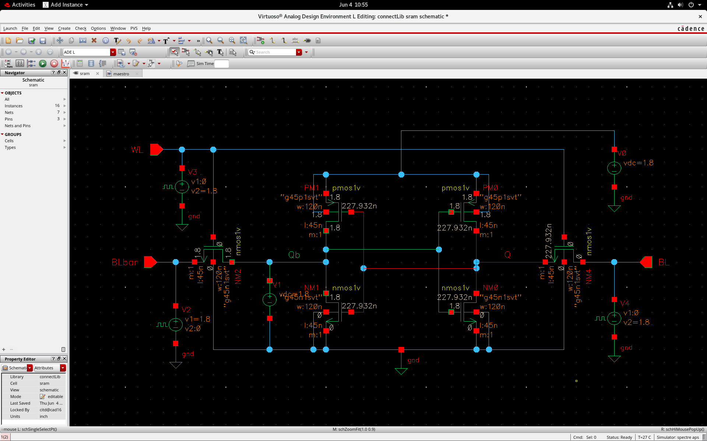
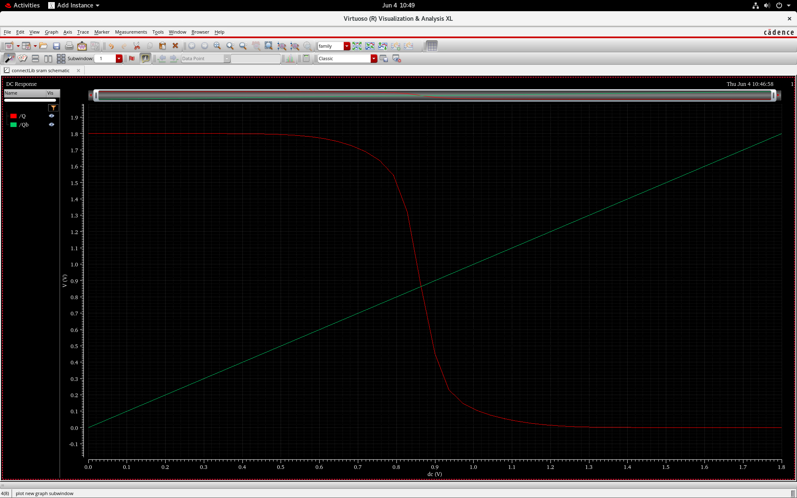
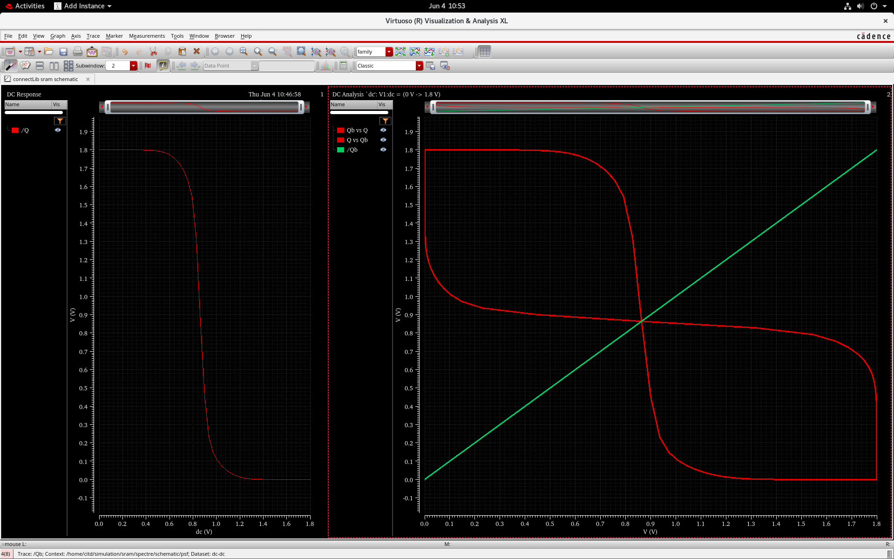

# 6T SRAM Cell Design and Stability Analysis

## 📌 Project Overview
This repository contains the schematic design, DC simulation, and Static Noise Margin (SNM) stability analysis of a 6-Transistor (6T) SRAM cell. The project was implemented using **Cadence Virtuoso** and simulated using the **Spectre APS** simulator at the **Central Institute of Tool Design (CITD)**.

---

## 🛠️ Tools & Specifications
* **EDA Tool:** Cadence Virtuoso (Schematic Editor & ADE L)
* **Simulator:** Spectre APS
* **Technology Node:** 45nm CMOS Process (`g45p1svt` / `g45n1svt`)
* **Supply Voltage ($V_{DD}$):** 1.8V

---

## 📐 Circuit Schematic

The standard 6T SRAM cell architecture consists of two cross-coupled CMOS inverters forming a bistable latch for data storage ($Q$ and $Qb$), alongside two NMOS access pass-transistors connected to Bitlines ($BL$ and $BLbar$) driven by the Wordline ($WL$).



---

## 📊 Simulation & Results

### 1. DC Voltage Transfer Characteristics (VTC)
A DC voltage sweep was performed on the internal storage nodes to analyze the inverter switching characteristics and logic transition behavior across the supply range ($0\text{ V}$ to $1.8\text{ V}$).



---

### 2. Static Noise Margin (SNM) & Butterfly Curve
The stability of the SRAM cell is evaluated using the Static Noise Margin (SNM). By superimposing the Voltage Transfer Characteristic (VTC) of the first inverter with the inverse VTC of the second inverter, the classic **Butterfly Curve** is obtained. 

* The maximum square embedded within the lobes defines the SNM.
* Symmetrical lobes confirm strong read/write stability and retention against operational noise.



---

## 📂 Repository Structure
```text
├── images/
│   ├── schematic.png
│   ├── dc_analysis.png
│   └── butterfly_curve.png
├── design/
│   └── sram_netlist.scs
└── README.md
